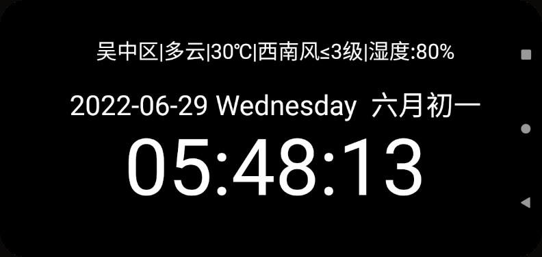

# 项目说明
此项目用途为:**老旧手机**显示时间,天气使用  时间为12小时格式  
具体可显示内容:**时间,农历,星期,天气** 
  
同时设定了**常亮**,天气每隔**2h**更新一次  
目前定位是苏州,使用的是高德的API  
## 备注
无设置菜单,所有代码里完成:`由于部分手机老旧以后触控不正常,所以只有一个显示页面` 
## 环境
安卓4.1  
## 自行编译说明
### 高德
高德申请**key**,然后填入`AndroidManifest.xml`  
且需要获取编译以后的sha1,具体看高德说明  
```
 <meta-data
            android:name="com.amap.api.v2.apikey"
            android:value="高德的key"/>
```
### 天气城市
修改`WeatherSearch.java`  
```
private String city="苏州"; //调整成对应城市  
```
